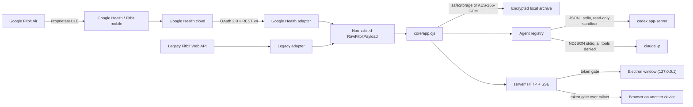

# Architecture

## Goals

- Fast UI that remains useful without an account through demo data.
- One backend implementation, reachable from a desktop window or a browser on
  another device. The desktop app and the server must not drift.
- Google Health API v4 as the primary provider, with the legacy Fitbit Web API
  isolated as a fallback.
- No tokens or secrets in the renderer.
- Partial consent and missing sensors must not block the dashboard.
- Encrypted per-day health archive and no upload to OpenFit services. Completed
  days are read locally without new provider requests.
- One normalization layer, so views do not depend on remote API shapes.
- Optional chat through a locally installed agent CLI. The project contains no
  API key, and no health data is sent until the user sends a message.

## Shape

`core/` holds every capability and knows nothing about Electron or HTTP.
`server/` exposes it over HTTP and SSE. Electron starts that same server on an
ephemeral loopback port and opens a window onto it, so there is exactly one
backend and one renderer data path.



## Security boundaries

### Backend

`core/` is the only place that:

- opens the OAuth loopback listener;
- knows the Client Secret, access token, and refresh token;
- calls `health.googleapis.com` and `api.fitbit.com`;
- reads and writes the cache and credentials;
- starts an agent CLI and forwards only the compact health context for the turn.

### Transport

The renderer reaches the backend over HTTP on the same origin that served it.
Every `/api/*` route and the app shell require a 32-byte token, presented as an
`HttpOnly` cookie or a bearer header and compared in constant time. Electron
binds `127.0.0.1:0` and loads a tokenized URL, so the gate is invisible on the
desktop and load-bearing on a tailnet.

Replacing the previous `contextBridge` allowlist with a token preserves the
properties that mattered:

| Property | Before | Now |
| --- | --- | --- |
| Renderer never sees tokens | IPC returned public status only | Same payloads over HTTP; `core/` never serializes secrets |
| Renderer cannot reach Node | `nodeIntegration: false`, `sandbox: true` | Unchanged; only the `preload` entry is gone |
| Only OpenFit can call the backend | Sender-frame URL check | Bearer token, constant-time compare |
| Backend is not world-reachable | Not listening at all | Explicit bind host; loopback under Electron |

The one deliberately unauthenticated route is `/oauth/callback`, mounted only
when `OPENFIT_PUBLIC_ORIGIN` is set: the provider redirects a browser there
without OpenFit's cookie. The OAuth `state` value is the CSRF check, and the
authorization code is useless without the PKCE verifier held in memory.

### Renderer

Runs with `nodeIntegration: false`, `contextIsolation: true`, and sandboxing
enabled. It receives public status and credential-free payloads, then normalizes
and compacts only the metrics needed before a turn. Served with
`default-src 'self'`, `connect-src 'self'`, `frame-ancestors 'none'`,
`nosniff`, and `Referrer-Policy: no-referrer`.

### Agent bridge

`core/agents/` resolves a CLI, starts it over stdio, and reuses its local login.
Codex threads use `read-only`, `approvalPolicy: never`, and disabled network
access. Claude Code turns deny every built-in tool and disable slash commands,
MCP, and user settings. Shell, patch, permission, and tool requests are refused
by the client in both. Fitbit and Google OAuth credentials never enter the model
context, and every error string is redacted before it reaches a client.

## Contracts

### Provider

```text
createPkce()
createAuthorizationUrl(config, state, pkce)
exchangeAuthorizationCode(config, code, verifier)
refreshAccessToken(config, token)
revokeToken(token)
syncData(accessToken, date, onProgress)
```

The core selects the adapter from `config.provider`. The UI always receives the
same `RawFitbitPayload`, which `normalizeFitbitData` converts into
`DashboardData`.

### Agent

```text
resolveBinary(env) -> path | null
create(options)    -> { getStatus, startTurn, cancelTurn, reset, dispose }
```

Backends are listed without being started, so rendering the picker spawns
nothing. See [AGENTS.md](AGENTS.md).

## Storage

| Host | Backend | Envelope |
| --- | --- | --- |
| Electron, OS keychain usable | `safeStorage` | `version: 1` |
| Server, or Linux `basic_text` | AES-256-GCM under `<data-dir>/master.key` | `version: 2` |

Both hosts read either envelope, so a data directory survives moving between
them — except that a `safeStorage` envelope cannot be decrypted by the server,
which reports the condition and asks for a reconnect rather than deleting data.
Writes are temp-file-plus-rename at mode `0600`; the key file is created with an
exclusive open so concurrent starts cannot race.

## Resilience

- API reads are independent. A 403 or 404 for ECG or temperature does not cancel
  steps and sleep.
- Each error is tied to its source and shown on the Devices page.
- Google Health is limited to fewer than five requests per second; `429`
  responses are retried with backoff.
- The token is refreshed before expiry, and rotated refresh tokens are saved
  atomically.
- A mostly failed sync does not replace the latest valid cache, and concurrent
  syncs are serialized in the core — so two devices cannot race one.
- Disconnecting an SSE client does not cancel an in-flight turn or sync.

## Deliberate decisions

1. **No reverse-engineered BLE.** Not a supported interface; it would make
   pairing and data access fragile or unsafe.
2. **System browser for OAuth.** No Google or Fitbit password passes through
   OpenFit.
3. **Dual provider.** Matches Google's recommended migration strategy, and the
   renderer contains no API branching.
4. **Demo first.** Visual development and tests need no real health data.
5. **Read-only scopes.** OpenFit does not modify the user's health profile.
6. **One HTTP core rather than two transports.** An IPC bridge plus an HTTP API
   would mean two adapters and a selection layer to keep in sync; the cost is
   moving from a frame check to a token check, which the table above accounts
   for.
7. **A token even on a private tailnet.** Tailnet membership is not treated as
   authentication, so an ACL mistake or a shared node is not enough to read
   health data.
8. **Loopback OAuth by default.** Google rejects a plain `http` non-loopback
   redirect, so connecting is host-bound unless the operator opts into an
   `https` origin via `tailscale serve`.

## Public distribution note

The documented Google Health client is a Web client and uses a Client Secret.
Encrypted storage protects it on the user's machine, but a secret distributed
inside an app is not a true global secret. To distribute OpenFit to third
parties, move the OAuth exchange to a minimal backend, complete Google
verification, and complete the required security review. The current setup is
appropriate for personal use and development.
