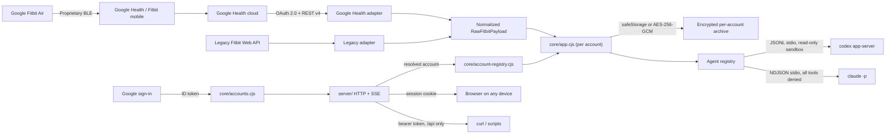

# Architecture

## Goals

- Fast UI that remains useful without an account through demo data.
- One backend implementation, reachable from a desktop window or a browser on
  another device. The desktop app and the server must not drift.
- Google Health API v4 as the primary provider, with the legacy Fitbit Web API
  isolated as a fallback.
- No tokens or secrets in the renderer.
- Partial consent and missing sensors must not block the dashboard.
- Encrypted per-day health archive and no upload to OpenFit services. Completed
  days are read locally without new provider requests.
- One normalization layer, so views do not depend on remote API shapes.
- Optional chat through a locally installed agent CLI. The project contains no
  API key, and no health data is sent until the user sends a message.

## Shape

`core/` holds every capability and knows nothing about Electron or HTTP.
`server/` exposes it over HTTP and SSE.

`core/app.cjs` is not a singleton. It builds one account's capabilities from one
data directory, and the server holds one of them per signed-in account. The
composition root is `server/compose.cjs`: it validates the origin, freezes the
OAuth identity, derives the `Secure` cookie flag from that origin, and builds
the shared secret store, the accounts store, the session store, and the account
registry before handing them to `createServer`.

Both hosts go through it. `server/bin.cjs` adds argument parsing, address
discovery and the banner; `electron/main.cjs` adds a fixed loopback port, the
OS keychain, and a window. Composing the same pieces twice is how the desktop
host silently stopped starting, so there is now one place to compose them and
`electron/main.test.ts` asserts that it does.



> `electron/main.cjs` runs the same graph inside the Electron main process,
> bound to `http://127.0.0.1:7790`. Because Google's consent screen is
> unreliable in an embedded user agent, the window hands `/auth/login` to the
> real browser; the browser's cookie jar is not the window's, so the callback —
> which is handled in this same process — mints the window an equivalent
> session cookie directly. See
> [SELF_HOSTING.md](SELF_HOSTING.md#the-desktop-app).

## Accounts

A Google `sub` claim identifies an account. `core/accounts.cjs` maps it to a
directory:

```text
<data-dir>/
  master.key                      instance-wide, 0600
  server-token                    instance-wide, 0600
  accounts/                       0700
    <sha256(sub)[0:16]>/          0700
      account.json                { sub, email, epoch, createdAt }, encrypted
      credentials.secure.json     tokens for this account
      health-cache.secure.json    this account's archive
```

The directory name is a truncated hash, not the raw subject: fixed length,
filesystem-safe, no disclosure of the Google account id to anything that can
list the directory, and traversal through a hostile value is structurally
impossible. A record whose `sub` does not hash to the directory it sits in is a
tampering signal and throws; it is never treated as an absent account, because
that would rewrite the file with `epoch: 1` and revive every session a
revocation was meant to kill.

`master.key` stays instance-wide rather than per account: the accounts index and
every account's app share one secret store, injected into `createApp` by
`core/account-registry.cjs`. The registry caches one app per account id and
refuses to rebind an id to a second directory, so one signed-in person's app can
never be handed to another.

The first sign-in on a data directory that predates accounts adopts the existing
root-level `credentials.secure.json` and `health-cache.secure.json` into its own
directory. That is gated on `accounts/` being absent, so it can only ever run
once.

## The session boundary

Two credentials exist and they do not reach the same things.

| | Google session cookie | Server bearer token |
| --- | --- | --- |
| Obtained by | signing in with Google | generated at `<data-dir>/server-token`, `0600` |
| Reaches | the app shell **and** `/api/*` | `/api/*` **only** |
| Names an account | yes, by `sub` | no — resolves to the sole account, or requires `X-OpenFit-Account` |
| Revocable | yes, by bumping the account epoch | only by replacing the file |
| Intended for | browsers | automation |

A non-API `GET` without a session gets a server-rendered sign-in page, so an
anonymous visitor never downloads the application bundle — and a browser holding
only a bearer token gets that page too. The token is deliberately not a way into
the UI: it predates multi-account support and names nobody.

The session cookie is `HttpOnly`, `SameSite=Lax`, `Secure` whenever
`OPENFIT_PUBLIC_ORIGIN` is set, and signed with an HKDF-separated key derived
from `master.key` — never the bytes that encrypt data. Its age is enforced
server-side from a signed `iat`, because a cookie's `Max-Age` is only a hint to
the browser and a captured value would otherwise be valid forever.

`epoch` is the whole of "log out everywhere". The cookie carries the epoch it
was issued under; every request compares it to the stored one with strict
integer equality, and `POST /auth/logout` with `{"everywhere": true}` increments
the stored value. There is no session list to walk and nothing to expire.

Sign-in itself is one Google authorization for both identity and health scopes.
`GET /auth/login` mints `state`, `nonce`, and a PKCE verifier, signs them into a
ten-minute `openfit_pending` cookie scoped to `/auth`, and redirects.
`GET /auth/callback` clears that cookie on every exit — success or failure — so
a state and verifier cannot be replayed for the rest of their lifetime. The
pending cookie and the session cookie are signed with the same key, so the
pending payload carries a `kind` tag: without it, a session cookie pasted into
`openfit_pending` would verify happily, and the reverse.

Because health scopes come from the sign-in consent, "reconnect" is "sign in
again with `prompt=consent`". `POST /api/connect` returns that path rather than
a redirect: the renderer calls it with `fetch`, which would otherwise follow the
302 and load Google's consent page as an XHR.

## Security boundaries

### Backend

`core/` and `server/` are the only places that:

- know the Client Secret, access token, and refresh token;
- validate a Google ID token and decide which account a request belongs to;
- call `health.googleapis.com` and `api.fitbit.com`;
- read and write the cache, credentials, and account records;
- start an agent CLI and forward only the compact health context for the turn.

The OAuth client is not configurable at runtime. It comes from
`OPENFIT_GOOGLE_CLIENT_ID` and `OPENFIT_GOOGLE_CLIENT_SECRET` and is frozen at
startup into one object used both for signing people in and for refreshing their
tokens, so the two cannot drift apart. The endpoint that once accepted
credentials from the UI is gone; it could never have configured sign-in anyway,
since it was itself behind the gate.

### Transport

The renderer reaches the backend over HTTP on the same origin that served it,
with the session cookie the browser already holds. See *The session boundary*
above for what each credential reaches.

Replacing the previous `contextBridge` allowlist with an HTTP gate preserves the
properties that mattered:

| Property | Before | Now |
| --- | --- | --- |
| Renderer never sees tokens | IPC returned public status only | Same payloads over HTTP; `core/` never serializes secrets |
| Renderer cannot reach Node | `nodeIntegration: false`, `sandbox: true` | Unchanged; only the `preload` entry is gone |
| Only OpenFit can call the backend | Sender-frame URL check | Signed session cookie, or a bearer token compared in constant time |
| Backend is not world-reachable | Not listening at all | Explicit bind host |

Three routes are deliberately unauthenticated, and only those three:
`GET /auth/login`, `GET /auth/callback`, and `POST /auth/logout`. Google
redirects a browser to the callback without an OpenFit session, so it cannot
require one; `state` is the CSRF check and the authorization code is useless
without the PKCE verifier signed into the pending cookie. Neither the OAuth
`error` parameter nor any provider error text is ever rendered — every failure
page shows a fixed string this repository wrote.

### Renderer

Receives public status and credential-free payloads, then normalizes and
compacts only the metrics needed before a turn. It has no field for a Client ID,
a Client Secret, or a callback URL, and no endpoint would accept one. Served
with `default-src 'self'`, `connect-src 'self'`, `form-action 'none'`,
`frame-ancestors 'none'`, `nosniff`, and `Referrer-Policy: no-referrer`.

`form-action 'none'` is why sign-in is a link and reconnect is a scripted
navigation rather than a form post. The renderer navigates only to a
same-origin absolute path the server returned; an absolute or protocol-relative
value is refused rather than followed, so a compromised response cannot turn
the reconnect button into an open redirect.

### Agent bridge

`core/agents/` resolves a CLI, starts it over stdio, and reuses its local login.
Codex threads use `read-only`, `approvalPolicy: never`, and disabled network
access. Claude Code turns deny every built-in tool and disable slash commands,
MCP, and user settings. Shell, patch, permission, and tool requests are refused
by the client in both. Fitbit and Google OAuth credentials never enter the model
context, and every error string is redacted before it reaches a client.

## Contracts

### Provider

```text
createPkce()
createAuthorizationUrl(config, state, pkce)
exchangeAuthorizationCode(config, code, verifier)
refreshAccessToken(config, token)
revokeToken(token)
syncData(accessToken, date, onProgress)
```

The core selects the adapter from `config.provider`. The UI always receives the
same `RawFitbitPayload`, which `normalizeFitbitData` converts into
`DashboardData`.

### Agent

```text
resolveBinary(env) -> path | null
create(options)    -> { getStatus, startTurn, cancelTurn, reset, dispose }
```

Backends are listed without being started, so rendering the picker spawns
nothing. See [AGENTS.md](AGENTS.md).

## Storage

| Host | Backend | Envelope |
| --- | --- | --- |
| Electron, OS keychain usable | `safeStorage` | `version: 1` |
| Server, or Linux `basic_text` | AES-256-GCM under `<data-dir>/master.key` | `version: 2` |

Both hosts read either envelope, so a data directory survives moving between
them — except that a `safeStorage` envelope cannot be decrypted by the server,
which reports the condition and asks for a reconnect rather than deleting data.
Writes are temp-file-plus-rename at mode `0600`; the key file is created with an
exclusive open so concurrent starts cannot race.

## Resilience

- API reads are independent. A 403 or 404 for ECG or temperature does not cancel
  steps and sleep.
- Each error is tied to its source and shown on the Devices page.
- Google Health is limited to fewer than five requests per second; `429`
  responses are retried with backoff.
- The token is refreshed before expiry, and rotated refresh tokens are saved
  atomically.
- A mostly failed sync does not replace the latest valid cache, and concurrent
  syncs are serialized in the core — so two devices cannot race one.
- Disconnecting an SSE client does not cancel an in-flight turn or sync.

## Deliberate decisions

1. **No reverse-engineered BLE.** Not a supported interface; it would make
   pairing and data access fragile or unsafe.
2. **System browser for OAuth.** No Google or Fitbit password passes through
   OpenFit.
3. **Dual provider.** Matches Google's recommended migration strategy, and the
   renderer contains no API branching.
4. **Demo first.** Visual development and tests need no real health data.
5. **Read-only scopes.** OpenFit does not modify the user's health profile.
6. **One HTTP core rather than two transports.** An IPC bridge plus an HTTP API
   would mean two adapters and a selection layer to keep in sync; the cost is
   moving from a frame check to a token check, which the table above accounts
   for.
7. **Authentication even on a private tailnet.** Tailnet membership is not
   treated as authentication, so an ACL mistake or a shared node is not enough
   to read health data.
8. **Loopback callback by default.** Google rejects a plain `http` non-loopback
   redirect, so sign-in is host-bound unless the operator opts into an `https`
   origin via `tailscale serve` and sets `OPENFIT_PUBLIC_ORIGIN`.
9. **Google sign-in instead of a shared browser token.** A token in a URL leaks
   through scrollback, shell history, and `journalctl`, names nobody, and cannot
   be revoked for one device. A session names an account and dies when its epoch
   moves. The token survives for `/api/*` automation, where there is no browser
   to sign in.
10. **One consent for identity and health.** Two separate authorizations would
    mean two places to expire and a "connected" state that can disagree with
    "signed in". Health access lapsing after Google's seven-day testing limit is
    then an ordinary, explainable state rather than a broken session.

## Public distribution note

The documented Google Health client is a Web client and uses a Client Secret,
supplied to the server through `.env`. That is sound for a server the user runs
themselves, and not sound for a secret shipped inside a distributed binary. To
distribute OpenFit to third parties, complete Google verification and the
required security review. The current setup is appropriate for personal use and
development.
